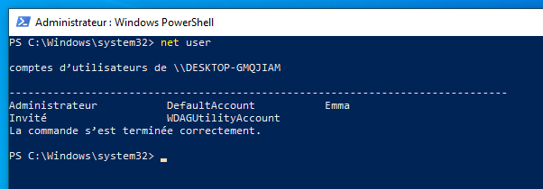
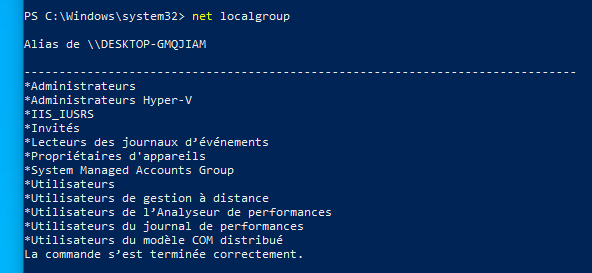
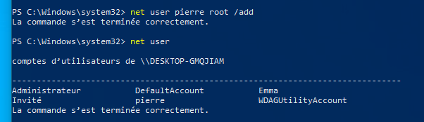
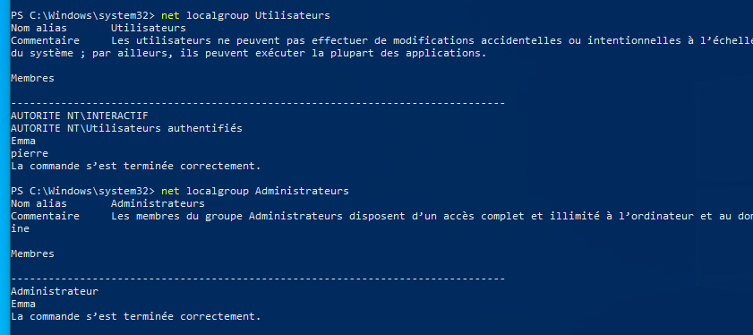
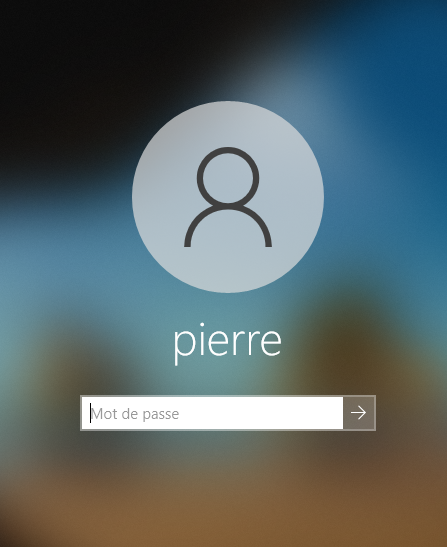
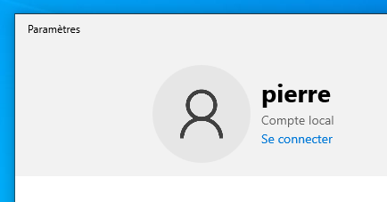
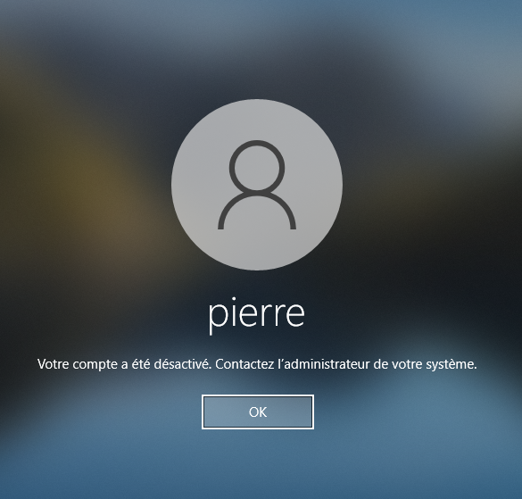

# TP4 : Renforcement de la politique de mots de passe d'un poste Windows autonome
## Configuration de la stratégie de sécurité locale sous Windows professionnel

## Classe : B3B
## Élèves : Emma Durand **[@emmadrd912](https://github.com/emmadrd912)** et Pierre Ceberio **[@PierreYnov](https://github.com/PierreYnov)** 

# Sommaire 

- [Le Lab](#le-lab)
- [Audit des comptes utilisateurs locaux](#audit-des-comptes-utilisateurs-locaux)
- [Application d'une stratégie locale de mots de passe](#application-dune-strat%C3%A9gie-locale-de-mots-de-passe)

## Le lab

- 1 machine avec Windows 10 Professionnel

## Audit des comptes utilisateurs locaux 

On liste les comptes présents sur la machine avec la commande ``net user``

L'utilisateur **Emma** a le rôle ``Administrateur``.

L'autre a le rôle ``Invité``.

L'utilisateur **Emma** a donc les privilèges administrateurs.

Les groupes sont visibles avec la commande ``net localgroup``

Ceux avec des commandes administrateurs nécessitent une attention particulière, donc ceux ci-dessous:

- Administrateurs
- Administrateurs Hyper-V
- System Managed Accounts Group
- Utilisateurs de gestion à distance
- Propriétaires d'appareils

Pour lister les utilisateurs de ces groupes on tape la commande ``net local group nom_du_groupe``

Utilisateurs du groupe **Administrateurs** : Emma, Administrateur

Utilisateurs du groupe **Administrateurs Hyper-V** : 

Utilisateurs du groupe **System Managed Accounts Group** : 
DefaultAccount

Utilisateurs du groupe **Utilisateurs de gestion à distance** : 

Utilisateurs du groupe **Propriétaires d'appareils** : 

On crée l'utilisateur **pierre** qui sera uniquement membre du groupe ``Utilisateurs`` avec la commande :

``net user pierre root /add`` 

Il est bien dans ``Utilisateurs`` :

Et pas dans ``Administrateurs`` :

On passe sur le compte **pierre**

On rentre le mot de passe, les animations de premières connexions Windows 10 s'animent puis nous pouvons vérifier que tout est bon :

On se déconnecte et on repasse sur le compte Administrateur, puis on tape la commande ``net user pierre /ACTIVE:NO``

On rentre le mot de passe, le compte est bien désactivé :

## Application d'une stratégie locale de mots de passe

**Rappeler quelles sont les caractéristiques recommandées d'un mot de passe robuste**

    
Le mot de passe doit respecter ces conditions :

- Suffisamment long (> 10 caractères)

- Composé de caractères variés (chiffre, majuscule, minuscule, ponctuation ...)

- N'est pas présent dans un dictionnaire ou n'est pas une phrase connue

- En lien avec votre identité

**Tapez gpedit.msc depuis un local admin local sur un cmd et dans la partie haute " Config ordinateur "**

    - Parcourir les paramètres et s'assurer que le poste est configuré pour refuser l'ouverture de session pour des user avec un mot de passe vide. sinon modifier et justifier la réponse
    
Le paramètre se trouve dans ``Configuration de l’ordinateur\Paramètres Windows\Paramètres de sécurité\Stratégies locales\Options de sécurité`` et il est bien activé donc c'est déjà bien paramétré : 

Le paramètre doit être activé. Un mot de passe vide est une menace pour la sécurité. 

    - appliquer la stratégie de mot de passe suivant :
        - longueur min : 10 caractères
        - le mot de passe doit respecter des exigences de complexité
        - durée de vie maximum du mot de passe : 6 mois
        - Le système de gestion des mots de passe ne doit pas utiliser un algorithme de chiffrement réversible pour le stockage du mot de passe.

On va dans ``Configuration de l’ordinateur\Paramètres Windows\Paramètres de sécurité\Stratégies de comptes\Stratégies de mot de passe\`` puis dans Longueur minimale du mot de passe, on passe le paramètre à 10 :

    - appliquez également la stratégie de verrouillage de compte, afin de limiter les chances de succès d'attaques sur les mot de passe :
        - Le système doit verrouiller un compte pendant 15 minutes après 5 tentatives de connexions infructueuses en moins 5 minutes.

On va dans ``Configuration de l’ordinateur\Paramètres Windows\Paramètres de sécurité\Stratégies de comptes\Stratégies de verrouillage du compte\``

**On vérifie les modifications**

Avec un faible mot de passe : 

Avec un mot de passe long, mais pas complexe :

Avec un mot de passe complexe, ça marche :

On remarque que la stratégie s'est bien appliquée.

- Tentative de connexions infructueuses :

Notre stratégie s'est bien appliquée, au bout de 5 tentatives de connexion, le compte s'est verrouillé.

